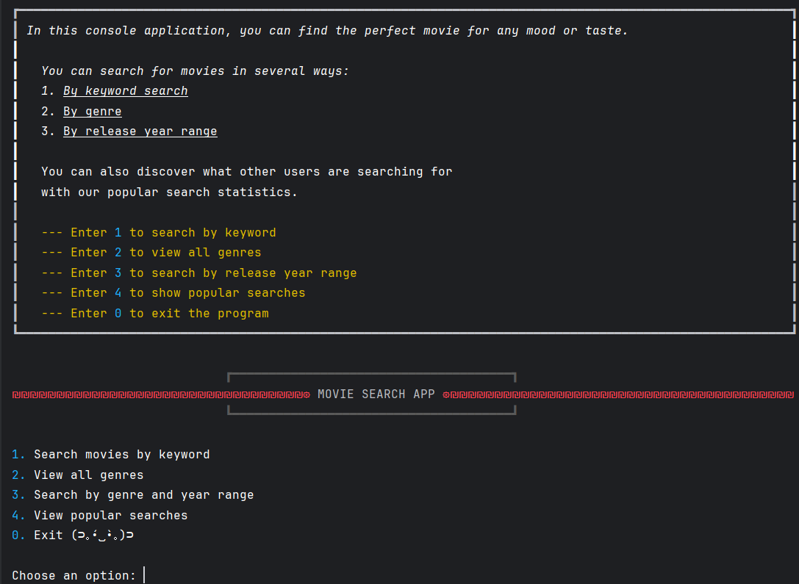
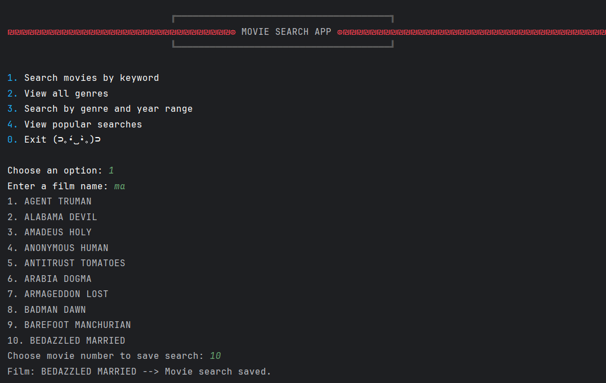
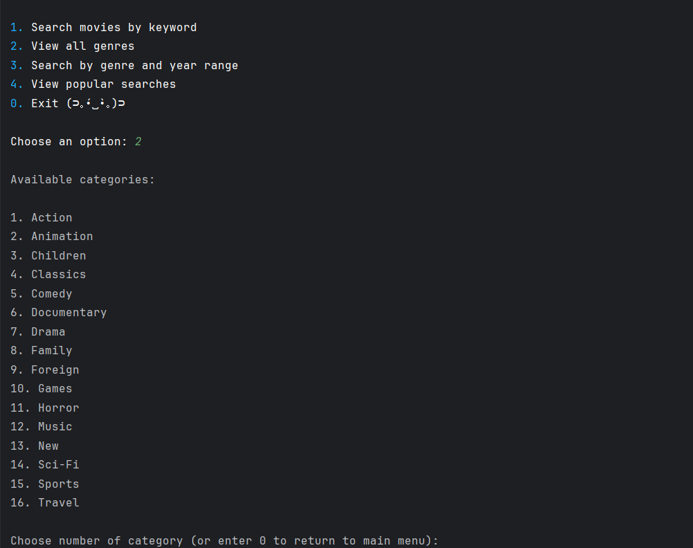
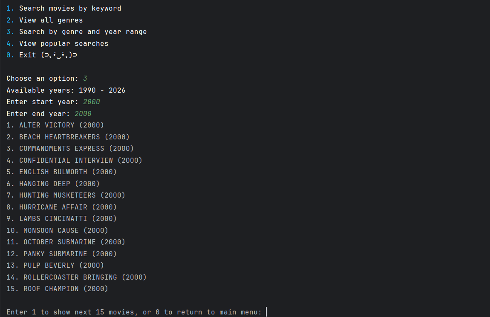
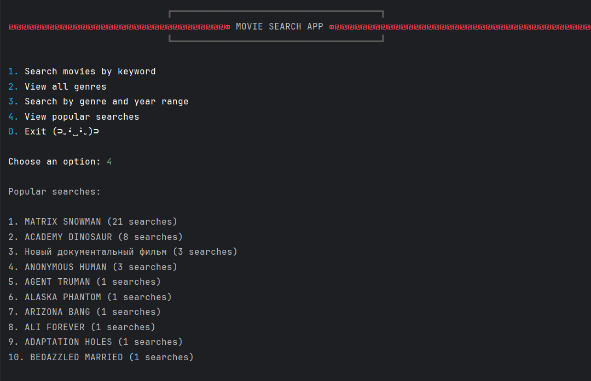

# Movie Search Application

## Description

Movie Search Application is a console-based Python application that allows users to search movies 
using the MySQL Sakila database.

The application supports searching movies by title, category, and year range. It also stores search statistics 
in MongoDB Atlas and displays the most popular movie searches.

---

## Features

* Search movies by title
* Search movies by category
* Search movies by year range
* Popular search statistics
* Pagination (15 movies per page)
* Input validation
* MySQL integration
* MongoDB Atlas integration

---

## Technologies

* Python 3
* MySQL (Sakila Database)
* MongoDB Atlas
* PyMySQL
* PyMongo
* python-dotenv

---

## Project Structure

```text
main.py

select_options.py
ui_module.py

sql_queries.py
sql_requests.py
my_sql_client.py
db_decorators.py

mongo_client.py
logger.py

settings.py

requirements.txt
README.md
```

---

## Installation

Clone the repository:

```bash
git clone https://github.com/Firemaniak/Python_project_Hrebennykov
cd Python_project_Hrebennykov
```

Install dependencies:

```bash
pip install -r requirements.txt
```

---

## Configuration

Create a `.env` file and add the following variables:

```env
MYSQL_HOST=your_host
MYSQL_USER=your_user
MYSQL_PASSWORD=your_password
MYSQL_DATABASE=your_database
MYSQL_PORT=3306

MONGO_URI=your_mongodb_connection_string
```

---

## Run Application

```bash
python main.py
```

---

## Screenshots

### Main Menu



### Search by Title



### Search by Category



### Search by Year Range



### Popular Searches



---

## Database Design

### MySQL

MySQL (Sakila database) is used to store movie information and perform movie searches.

### MongoDB Atlas

MongoDB Atlas is used to store and analyze movie search statistics.

---

## Author

Oleksii Hrebennykov / 121225-ptm

---

## Future Improvements

* Export search results to file
* Advanced movie filters
* User authentication
* Web interface
* Docker support
